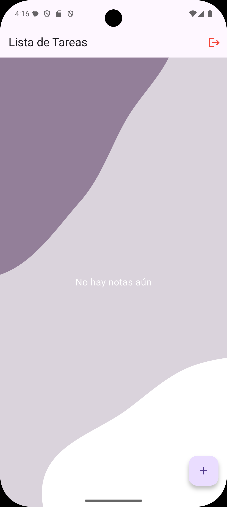
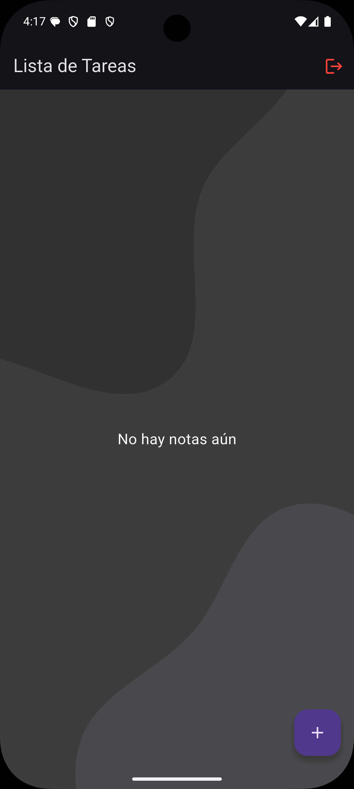

## **Proyecto: Lista de Tareas**

### **1. Introducción**
Este proyecto es una aplicación desarrollada en Flutter para gestionar una lista de tareas. Cuenta con funcionalidades esenciales como registro e inicio de sesión, así como la posibilidad de agregar, editar y eliminar notas. Además, ofrece soporte para modo claro y oscuro según la configuración del sistema.

### **Funcionalidades**
- Registro de usuario
- Inicio de sesión
- Agregar, editar y eliminar notas
- Modo claro y oscuro


### **Detalle de las funcionalidades**

#### **Registro de Usuario**
Desde la pantalla de registro puedes crear una cuenta con un nombre de usuario, correo electrónico y una contraseña. La contraseña debe confirmarse antes de continuar.

#### **Inicio de Sesión**
Si ya tienes una cuenta, solo ingresas tu correo y contraseña. Si todo está bien, te lleva a la pantalla principal.

#### **Gestión de Notas**
En la pantalla principal puedes:
- Agregar notas con título y contenido.
- Editar notas existentes.
- Eliminar notas (con confirmación para evitar errores).
- Marcar como completadas.

#### **Modo Claro y Oscuro**
La app cambia automáticamente entre modo claro y oscuro según la configuración del sistema del dispositivo.

### **Capturas de pantalla**

| Modo Claro | Modo Oscuro |
|------------|-------------|
|  |  |

### **2. Navegación entre pantallas**

La navegación en esta aplicación se gestiona mediante rutas nombradas definidas en MaterialApp. Esto permite organizar la transición entre pantallas de manera clara.

#### **Definición de Rutas**
En el archivo `main.dart`, las rutas están configuradas de la siguiente manera:

```dart
return MaterialApp(
  debugShowCheckedModeBanner: false,
  title: 'Lista de Tareas (API)',
  themeMode: ThemeMode.system,
  theme: ThemeData.light(),
  darkTheme: ThemeData.dark(),
  initialRoute: '/',
  routes: {
    '/': (context) => const LoginScreen(),
    '/register': (context) => const RegisterScreen(),
    '/home': (context) => const HomeList(),
  },
);
```

**Explicación de las rutas:**
- `/`: Pantalla de inicio de sesión (LoginScreen).
- `/register`: Pantalla de registro de usuario (RegisterScreen).
- `/home`: Pantalla principal para gestionar las tareas (HomeList).

#### **Navegación**

**Inicio de sesión a la pantalla principal:**
Si las credenciales son correctas, se redirige al usuario a HomeList:
```dart
Navigator.pushReplacementNamed(context, '/home');
```
Ubicación en el código: `loginscreen.dart` (método `login()`).

**De inicio de sesión a registro:**
Si el usuario no tiene cuenta, puede navegar a RegisterScreen:
```dart
Navigator.pushNamed(context, '/register');
```
Ubicación en el código: `loginscreen.dart` (botón "Crear cuenta").

**Registro exitoso y redirección a inicio de sesión:**
Si el usuario se registra correctamente, vuelve a la pantalla de inicio de sesión:
```dart
Navigator.pushReplacementNamed(context, '/');
```
Ubicación en el código: `register_screen.dart` (método `register()`).

**Cerrar sesión y regresar a inicio de sesión:**
Desde la pantalla de tareas, el usuario puede cerrar sesión y volver a LoginScreen:
```dart
Navigator.pushReplacementNamed(context, '/');
```
Ubicación en el código: `home_list.dart` (método `logout()`).

### **3. Descripción de Pantallas**

#### **LoginScreen (Pantalla de Inicio de Sesión)**
La pantalla de inicio de sesión es la primera vista de la aplicación. Su función principal es permitir el acceso mediante credenciales correctas y, en caso de no tener una cuenta, ofrecer la opción de registrarse.

**Estructura y Funcionamiento**
- **Campos de entrada:** Se utilizan dos `CustomTextField`, uno para el nombre de usuario y otro para la contraseña. La contraseña se oculta para mayor seguridad.
- **Botón de inicio de sesión:** Implementado con `CustomButton`, ejecuta la función `login()`, que verifica los campos y, si la autenticación es exitosa, redirige a `HomeList`.
- **Redirección al registro:** Un botón permite navegar a la pantalla de registro con `Navigator.pushNamed(context, '/register')`.
- **Manejo del teclado:** Si el teclado está abierto, el logo de la aplicación se oculta mediante `AnimatedOpacity`.

**Navegación en LoginScreen**
- Si el usuario ingresa credenciales correctas → `Navigator.pushReplacementNamed(context, '/home')`.
- Si los datos son incorrectos → Se muestra un `SnackBar` con un mensaje de error.
- Si el usuario no tiene cuenta → Puede navegar a `RegisterScreen` con `Navigator.pushNamed(context, '/register')`.

#### **RegisterScreen (Pantalla de Registro)**
La pantalla de registro permite a los nuevos usuarios crear una cuenta ingresando un nombre de usuario, correo electrónico y contraseña.

**Estructura y Funcionamiento**
- **Campos de entrada:** Se usan `CustomTextField` para ingresar nombre de usuario, correo electrónico y contraseña, con un campo adicional para confirmar la contraseña.
- **Validación de datos:** Se verifica que todos los campos estén completos y que ambas contraseñas coincidan antes de enviarlas a la API.
- **Botón de registro:** Ejecuta el método `register()`, y si el registro es exitoso, se redirige a `LoginScreen`.
- **Redirección a la pantalla de inicio de sesión:** Si el usuario ya tiene una cuenta, puede regresar con `Navigator.pop(context)`.

**Navegación en RegisterScreen**
- Si el usuario se registra correctamente → `Navigator.pushReplacementNamed(context, '/')`.
- Si hay un error → Se muestra un `SnackBar` con la descripción del problema.
- Si el usuario ya tiene una cuenta → Puede regresar con `Navigator.pop(context)`.

#### **Uso de Common Widgets**
Para mantener la interfaz uniforme y el código modular, tanto `LoginScreen` como `RegisterScreen` utilizan componentes reutilizables definidos en `common_widgets.dart`.

- **CustomTextField**
  - Se usa para los campos de entrada en ambas pantallas.
  - Permite personalizar el texto de la etiqueta y la visibilidad de la contraseña.

- **CustomButton**
  - Se utiliza en los botones de iniciar sesión y registrar.

#### **HomeList (Pantalla Principal de Tareas)**
La pantalla principal muestra todas las tareas del usuario y permite gestionarlas.

- La interfaz está estructurada con un `Scaffold`, que contiene una `AppBar` con el botón de cerrar sesión.
- Se utiliza un `Stack` para agregar una imagen de fondo, que cambia dinámicamente según el modo claro u oscuro.
- Las notas se listan dentro de una `ListView.builder`, donde cada elemento se muestra en una `Card` con opciones para editar y eliminar.
- Un `FloatingActionButton` permite agregar nuevas notas.

### **Documentación:**

* **[Documentación - Entrega Final](lib/resources/documentation/documentationEntrega.md)**