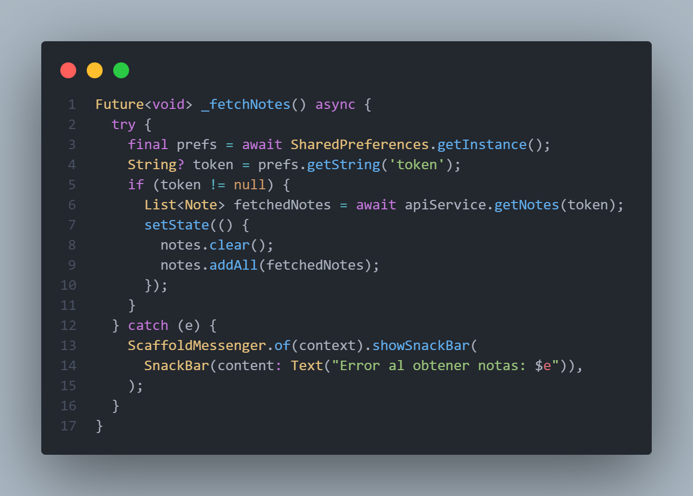
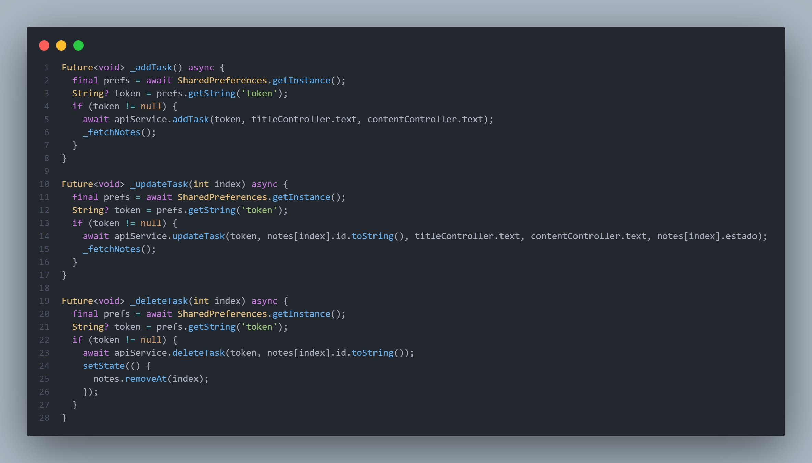
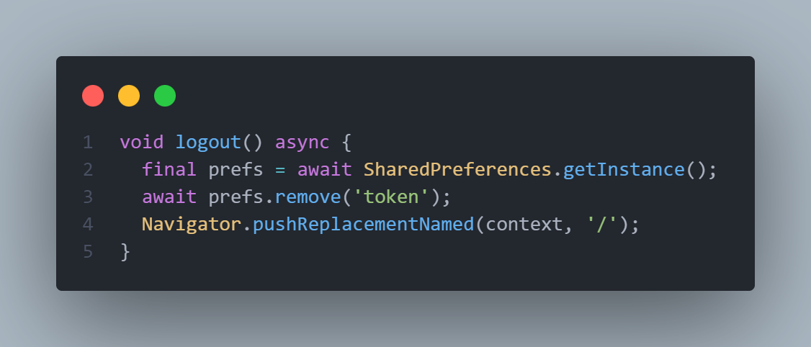
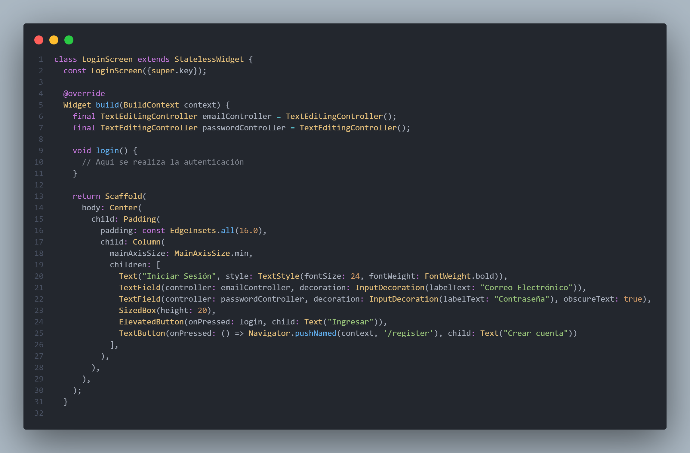
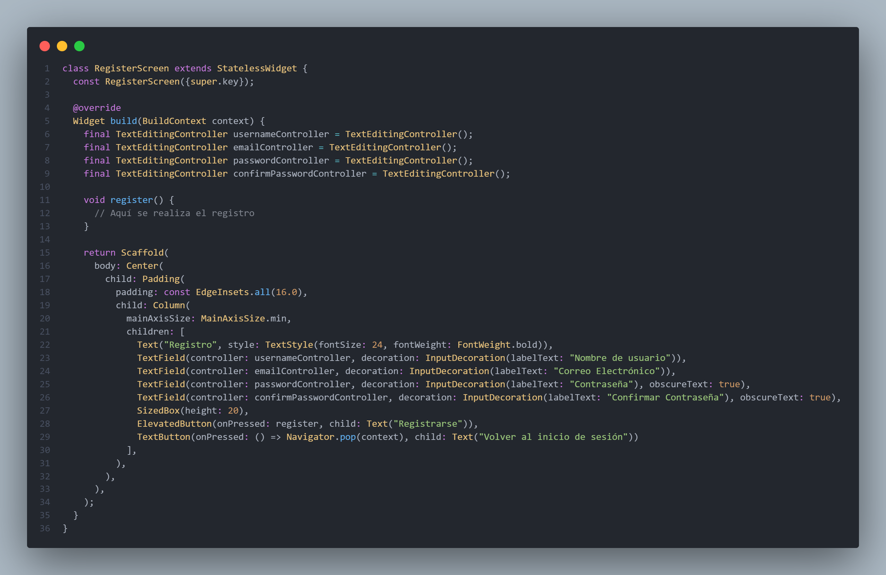
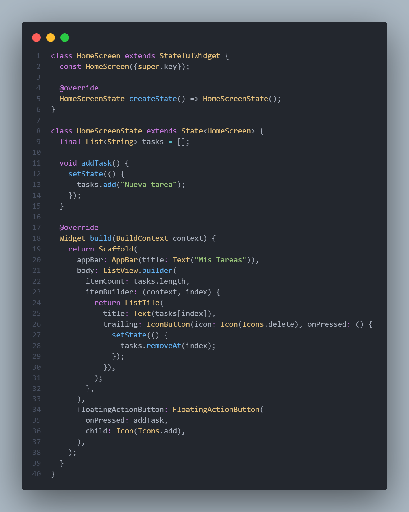

# Evaluación Final del Módulo

## 1. Introducción

Este documento presenta el proyecto final del módulo, donde desarrollamos una app móvil para gestionar tareas conectándose a una API externa. La idea fue crear una interfaz fácil de usar, donde los usuarios puedan registrarse, iniciar sesión, agregar, editar y borrar tareas, todo con seguridad y sin perder la información.  

La app está hecha en **Flutter** con **Dart** como lenguaje de programación y usa el paquete `http` para comunicarse con una API REST. Para manejar la autenticación, usamos un sistema de **tokens**, que se guardan en `SharedPreferences`, permitiendo que los usuarios mantengan su sesión activa y tengan una mejor experiencia.

## 2. Tecnologías Utilizadas
Para la implementación del proyecto, se han utilizado las siguientes tecnologías y herramientas:

- **Lenguaje de Programación:** Dart (Flutter)
- **Framework de Desarrollo:** Flutter
- **Almacenamiento Local:** SharedPreferences (para persistencia de sesión)
- **Autenticación:** API REST con manejo de tokens
- **Conexión a API:** HTTP package
- **Gestor de Dependencias:** Pub.dev
- **IDE:** Android Studio / Visual Studio Code

## 3. Arquitectura y Organización del Proyecto
La app está dividida en varios módulos para que sea más fácil de mantener y escalar. El código está organizado de la siguiente forma:

```
FLUTTER_02
│── lib
│   │── assets (Recursos gráficos e imágenes)
│   │── models (Definiciones de clases y estructuras de datos)
│   │── resources (Documentación interna y capturas de pantalla)
│   │── screens (Pantallas principales de la aplicación)
│   │── service (Gestión de llamadas a la API)
│   │── widgets (Componentes reutilizables para la interfaz)
│── main.dart (Punto de entrada de la aplicación)
│── pubspec.yaml (Archivo de configuración y dependencias)
```

## 4. Funcionamiento de la Aplicación

La app está diseñada para que los usuarios puedan iniciar sesión, recibir datos de la API y gestionar sus tareas de forma sencilla. A continuación,se muestra cómo se conectan sus diferentes partes.

### 4.1. Inicio de Sesión y Registro

El proceso de inicio de sesión permite al usuario ingresar sus credenciales para acceder a la aplicación. Si los datos son correctos, se genera y almacena un token de autenticación que mantiene la sesión activa.


### 4.2. Pantalla Principal y Gestión de Tareas

Cuando un usuario inicia sesión correctamente, es dirigido a la pantalla principal, donde se cargan y muestran sus tareas. Estas se recuperan de la API utilizando el token de autenticación almacenado.



### 4.3. Agregar, Editar y Eliminar Tareas

Los usuarios pueden agregar, editar y eliminar tareas de su lista usando los siguientes códigos:



### 4.4. Persistencia de Datos y Cierre de Sesión

Para mantener la sesión activa hasta que el usuario decida cerrar sesión, se usa `SharedPreferences` para almacenar el token y recuperar su estado al abrir la aplicación nuevamente.



## 5. Aspecto de la importante de la UI

### 5.1 Pantalla de Login

La pantalla de inicio de sesión es lo primero que ve el usuario al abrir la app. Tiene un formulario donde debe ingresar su correo y contraseña para acceder. El diseño es simple y claro, con campos de texto para los datos y un botón para iniciar sesión. También incluye otro textButton que lleva a la pantalla de registro para quienes aún no tienen cuenta.

Aquí está el código que define la pantalla de inicio de sesión:



### 5.2 Pantalla de Registro

La pantalla de registro es similar a la de inicio de sesión, pero con algunos elementos extra. Permite a los nuevos usuarios crear una cuenta ingresando su nombre de usuario, correo y contraseña. También tiene un campo para confirmar la contraseña y evitar errores al escribirla.

Cuando el usuario llena los datos, puede presionar el botón de registro para enviar la información a la API y crear su cuenta. Además, hay un botón para volver a la pantalla de inicio de sesión si ya tiene una cuenta.

El código que implementa la pantalla de registro:



### 5.3 Pantalla de Inicio

Después de iniciar sesión, el usuario es llevado a la pantalla de inicio, donde puede ver sus tareas. Estas se cargan desde la API y se muestran en una lista interactiva, con opciones para editar o eliminar cada una. También hay un botón flotante para agregar nuevas tareas.  

El diseño es dinámico y práctico, pensado para que la gestión de tareas sea fácil y rápida. Para mostrar la lista, se usa `ListView.builder`, lo que hace que la interfaz siga funcionando bien incluso si hay muchas tareas.

El código de la pantalla de inicio es el siguiente:



### **Vídeo funcionamiento del proyecto**

<p align="center">
<a href="https://www.canva.com/design/DAGhZwmf6y8/mbwCe7XtaHkeHnAB1IfyNg/watch?utm_content=DAGhZwmf6y8&utm_campaign=designshare&utm_medium=link2&utm_source=uniquelinks&utlId=h8e854c6366">

</a>
</p>


### **Solucionado problema teclado**

<p align="center">

</p>
